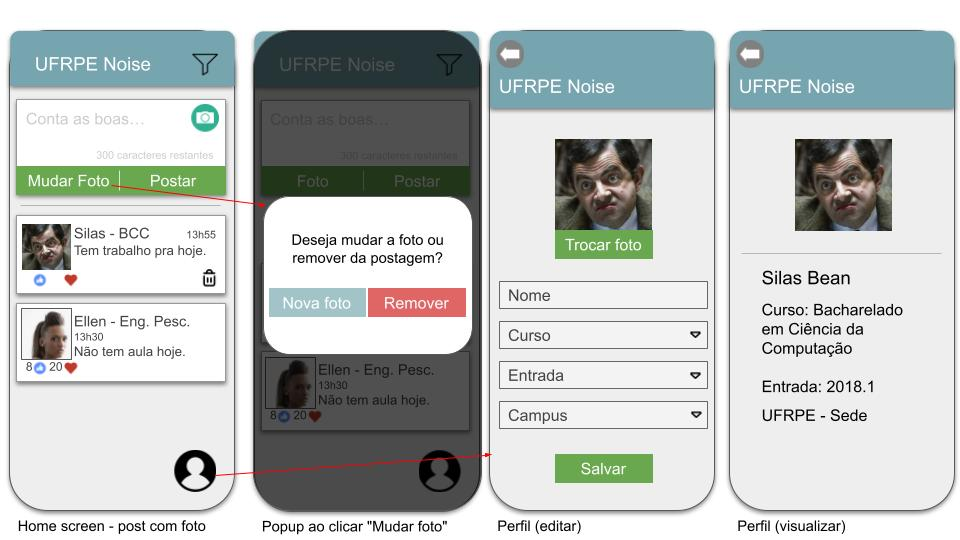
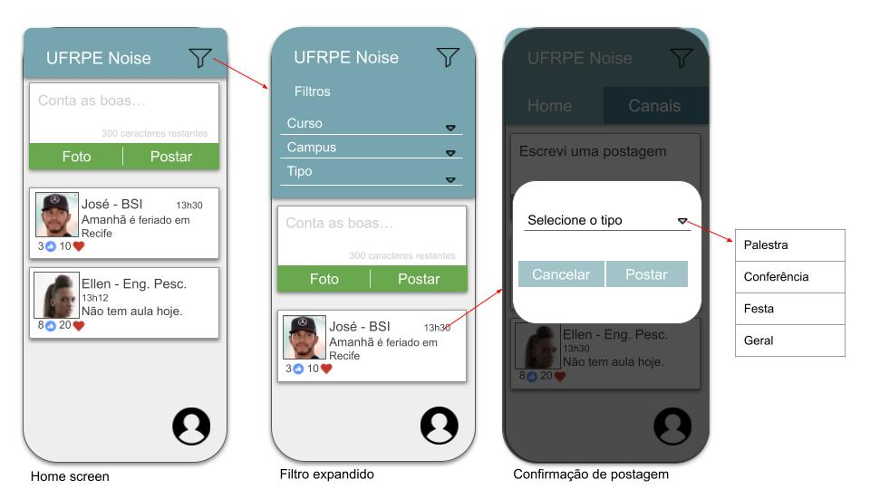

# fpa-flutter

Repositório criado para projeto da disciplina Fundamentos de Programação Aplicada.
<br><hr>
## Sobre
<br><hr>

## Wireframe



<br><hr>
## Executando a aplicação
- Rode o comando ```open -a Simulator``` para iniciar o simulador.
- Rode ```flutter run``` para levantar a aplicação no simulador ou ```flutter run --debug``` para rodar no modo debug (com suporte para hot reload).

<br><hr>

<br><br><hr>
UFRPE - Programa de Pós-Graduação em Informática Aplicada. 2021.1
<br>
Por Yuri Nascimento
