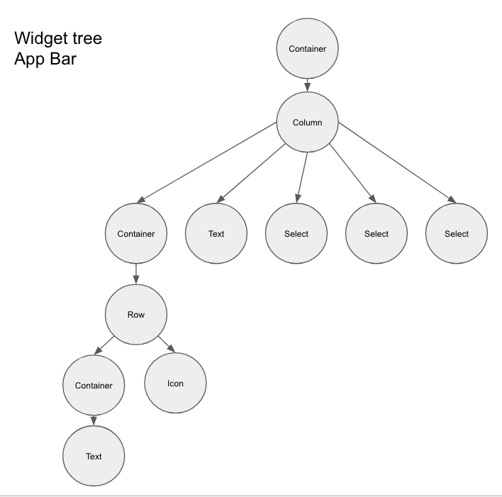
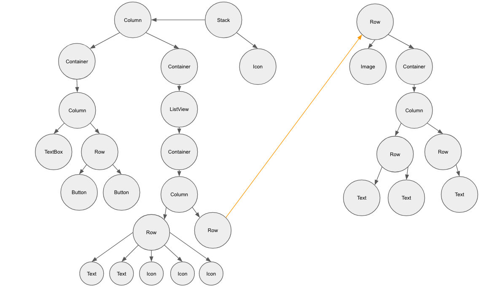
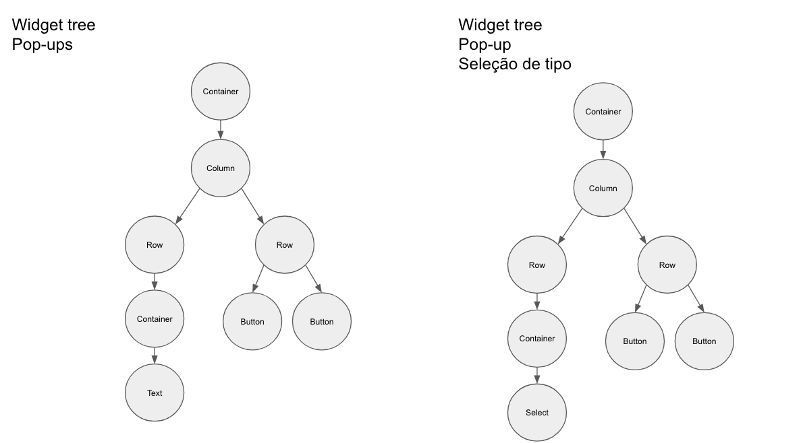
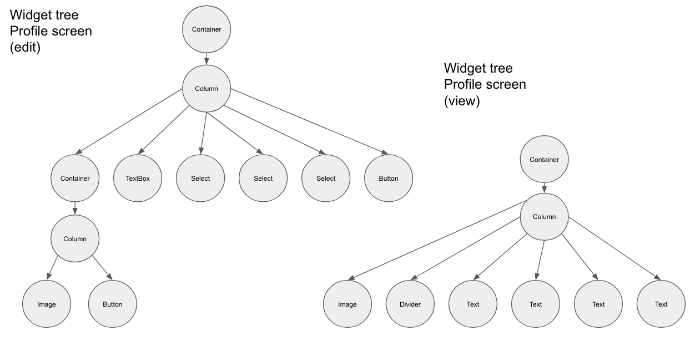
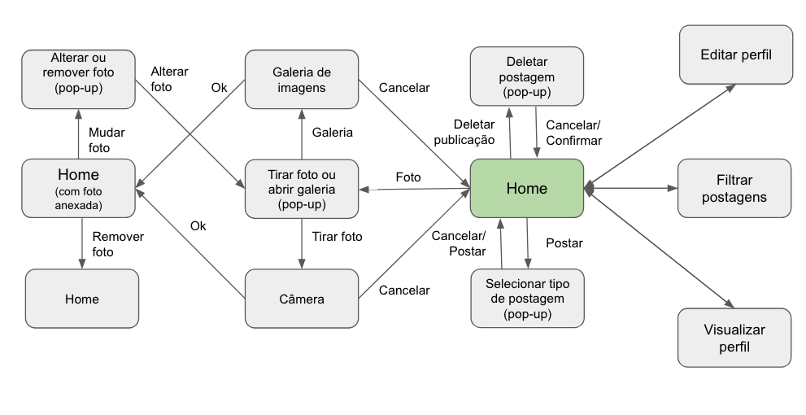
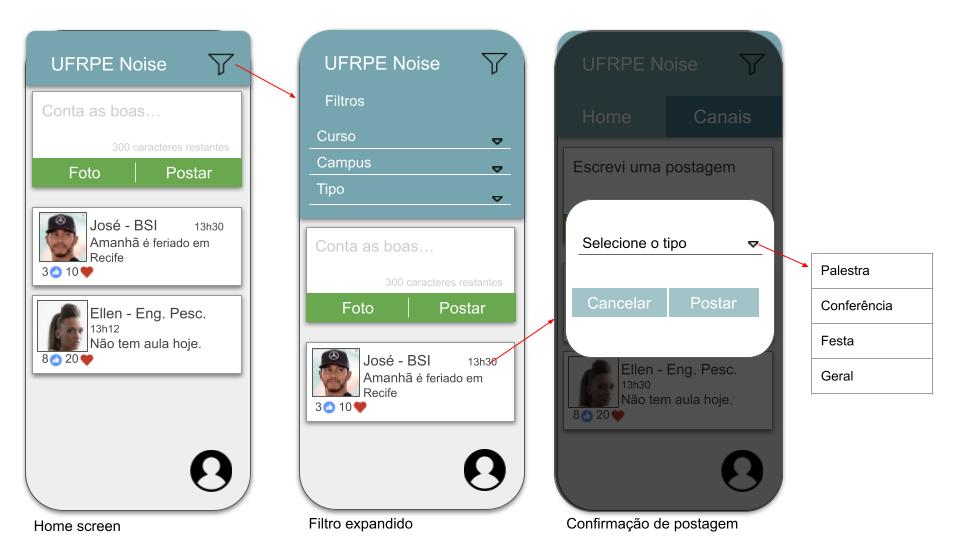
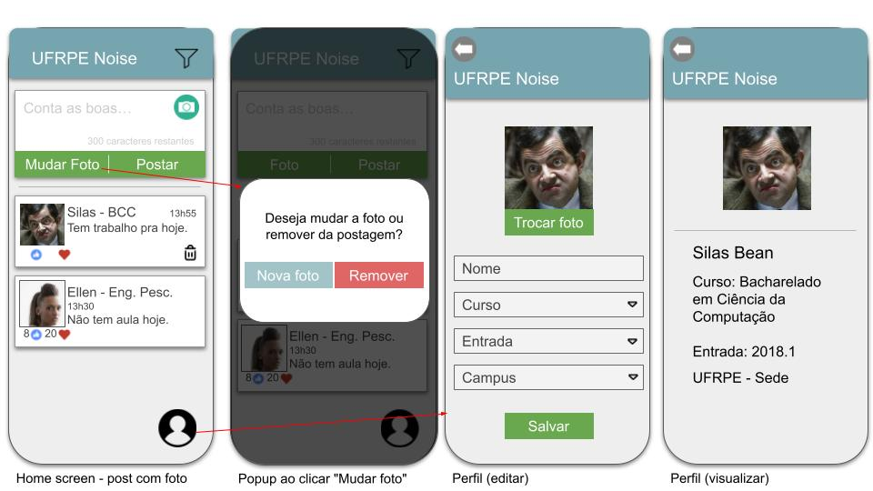

# UFRPE Noise

## Sobre
O UFRPE Noise foi pensado para ser uma rede de compartilhamento de informações entre alunos e servidores da UFRPE. Com postagens curtas e a possibilidade de enviar imagens, esperamos facilitar a comunicação de eventos na universidade como palestras, seminários, feira de profissões, calouradas, olimpíadas, ações, e tudo que acontece na nossa Rural.

Cada usuário poderá ter um perfil, realizar postagens e visualizar as postagens feitas por outros alunos e servidores da UFRPE, bem como filtrar o tipo de postagem que deseja visualizar.
<br><hr>
## Widget tree

Widget tree app bar (filter expanded)
<br><br>

Widget tree home screen
<br><br>

Widget tree pop-ups 
<br><br>

Widget tree profile screen
<br><br>

<br><hr>
## Fluxo de telas


<br><hr>
## Wireframe

Home screen, confirmação de exclusão de postagem e incluir post com imagem.
<br><br>


Home screen, filtrar postagens e criar postagem nova.
<br><br>


Mudar ou remover foto de postagem, editar perfil e visualizar perfil.
<br><br>
<hr>

## Executando a aplicação
- Rode o comando ```open -a Simulator``` para iniciar o simulador.
- Rode ```flutter run``` para levantar a aplicação no simulador ou ```flutter run --debug``` para rodar no modo debug (com suporte para hot reload).

<br><br><hr>
UFRPE - Programa de Pós-Graduação em Informática Aplicada. 
2021.1
Fundamentos de Programação Aplicada
<br>
Por Yuri Nascimento
